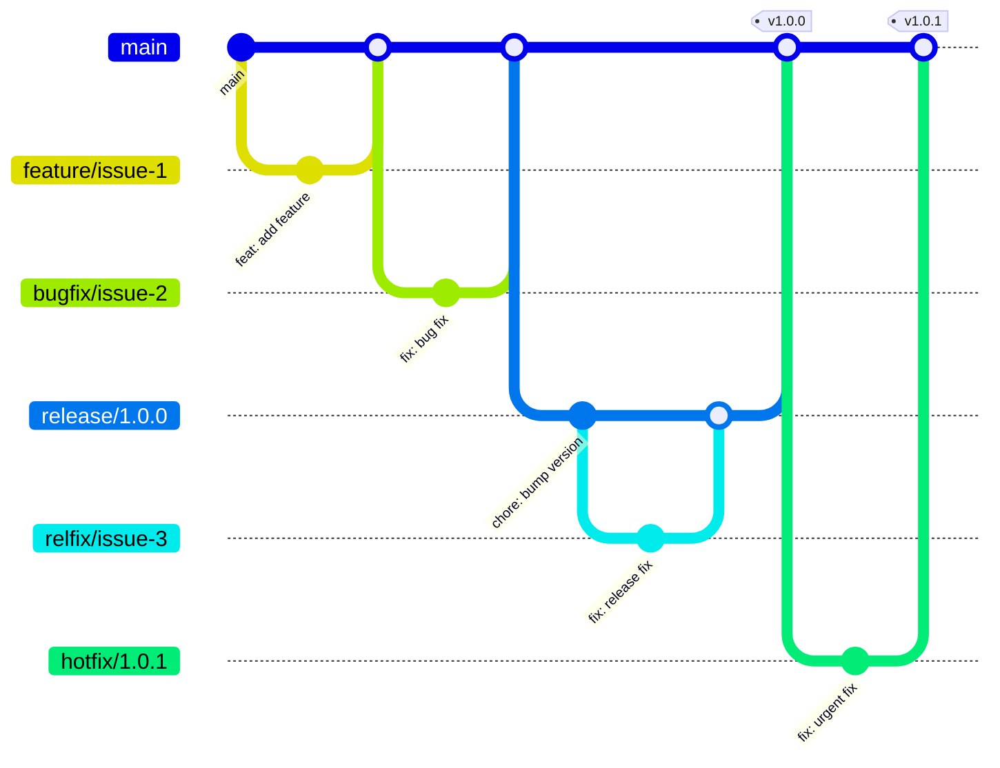

# Git Guidelines <!-- omit in toc -->

This document defines the Git workflow, branch naming conventions, commit message standards, and pull request process for the MCP Server NestJS module library. Its objective is to ensure a consistent, maintainable, and collaborative development process, while enforcing best practices and compatibility with the @modelcontextprotocol/sdk. Use this guide to understand how to contribute, manage branches, and maintain code quality in this project.

## Table of Contents <!-- omit in toc -->

- [Branch Structure](#branch-structure)
- [Workflow Diagram](#workflow-diagram)
- [Branch Naming Conventions](#branch-naming-conventions)
- [Commit Guidelines](#commit-guidelines)
  - [Format](#format)
  - [Types](#types)
  - [Examples](#examples)
- [Pull Request Process](#pull-request-process)
- [Handling Conflicts](#handling-conflicts)
- [Branch Protection and Pull Request Rules](#branch-protection-and-pull-request-rules)
- [Revert and Rebase Policy](#revert-and-rebase-policy)
- [Automation](#automation)
- [Special Workflow Cases](#special-workflow-cases)
  - [Bugfixes vs Hotfixes vs Relfixes](#bugfixes-vs-hotfixes-vs-relfixes)
    - [Bugfix](#bugfix)
    - [Hotfix](#hotfix)
    - [Relfix](#relfix)
  - [Releases](#releases)
  - [SemVer Versioning](#semver-versioning)
- [Version Progression Validation](#version-progression-validation)

This document outlines our Git workflow, branch naming conventions, and commit message guidelines.

## Branch Structure

We follow a trunk-based development workflow with the following branches:

| Branch Type   | Created From | PR Target    | Purpose                                              |
| ------------- | ------------ | ------------ | ---------------------------------------------------- |
| `main`        | -            | -            | Stable production code                               |
| `feature/*`   | `main`       | `main`       | New features and enhancements                        |
| `bugfix/*`    | `main`       | `main`       | Non-urgent bug fixes                                 |
| `hotfix/*`    | `main`       | `main`       | Urgent production fixes                              |
| `release/*`   | `main`       | `main`       | Release preparation                                  |
| `relfix/*`    | `release/*`  | `release/*`  | Bug fixes specifically for a release in preparation  |

## Workflow Diagram



**Key points:**
- All branches are created from `main`
- All branches (except `relfix/*`) create PRs to `main`
- `relfix/*` branches create PRs to their parent `release/*` branch
- `release/*` branches are used for release preparation before merging to `main`

## Branch Naming Conventions

- `feature/issue-{id}-{short-description}`: For new features
- `bugfix/issue-{id}-{short-description}`: For non-critical bug fixes
- `hotfix/{version-number}`: For urgent production bug fixes requiring immediate deployment
- `relfix/issue-{id}-{short-description}`: For bug fixes specifically targeting a release in preparation
- `release/{version-number}`: For release preparation (follows SemVer)

Examples:

- `feature/issue-42-user-authentication`
- `bugfix/issue-75-broken-login`
- `hotfix/1.2.1`
- `relfix/issue-83-validation-error`
- `release/1.2.0`

## Commit Guidelines

We use conventional commits for clear and structured history.

### Format

```
<type>(<scope>): <subject>

<body>

<footer>
```

### Types

- `feat`: A new feature
- `fix`: A bug fix
- `docs`: Documentation changes
- `style`: Formatting changes
- `refactor`: Code restructuring without feature changes
- `perf`: Performance improvements
- `test`: Test additions or corrections
- `chore`: Build process or tool changes

### Examples

```
feat(auth): add user login functionality

Implement JWT-based authentication with refresh tokens.

Closes #24
```

```
fix(api): correct response status codes

Change HTTP status from 200 to 201 for resource creation endpoints.

Resolves #56
```

## Pull Request Process

1. Create a branch from `main` using the appropriate naming convention
2. Make your changes and commit them following the commit guidelines
3. Pull the latest changes from `main`
4. Push your branch and create a PR to `main`
5. Request at least one reviewer
6. Address any feedback from code reviews
7. Once approved, the PR will be merged by a maintainer

## Handling Conflicts

If conflicts arise when merging:

1. Pull the latest changes from `main`
2. Resolve conflicts locally
3. Commit the resolved conflicts
4. Push the changes to your branch

## Branch Protection and Pull Request Rules

- Only `main` and `release/*` branches accept pull requests. PRs to any other branch are not permitted (except `relfix/*` to `release/*`).
- The branches `main` and all `release/*` branches **must be protected** against direct push and force push. Only merges via pull request are allowed.
- All other branches (e.g., `feature/*`, `bugfix/*`, `hotfix/*`, `relfix/*`) can receive updates via direct push.
- This ensures the stability and integrity of the main and release branches, while allowing flexibility in feature and fix branches.

## Revert and Rebase Policy

<!-- TODO: Define and document the policy for revert, squash, and rebase operations on protected branches. For now, follow standard Git best practices and avoid force pushes on protected branches. -->

## Automation

All possible validations and checks (linting, tests, version progression, branch naming, etc.) are automated via CI/CD workflows. Manual steps should be minimized and clearly documented if required.

## Special Workflow Cases

### Bugfixes vs Hotfixes vs Relfixes

We use different branch types for different kinds of fixes:

#### Bugfix

For non-urgent issues:

1. Create a `bugfix/` branch from `main`
2. Fix the issue and commit changes
3. Create a PR to `main`
4. Changes will be merged after review

#### Hotfix

For urgent production issues requiring immediate deployment:

1. Create a `hotfix/` branch from `main`
2. Fix the issue and commit changes
3. Create a PR to `main`
4. After approval, merge to `main`
5. Deploy to production immediately after merging to `main`

#### Relfix

For issues found during release preparation:

1. Create a `relfix/` branch from the specific `release/*` branch
2. Fix the issue and commit changes
3. Create a PR targeted to the same `release/*` branch
4. These changes will be included when the release is merged to `main`

### Releases

To prepare a new release (using SemVer):

1. Create a `release/` branch from `main` (e.g., `release/1.2.0`)
2. Only `relfix/` branches can be merged into this branch
3. When ready, create a PR from `release/*` to `main`
4. After approval, merge to `main`
5. Tag the release in `main` with the version number

### SemVer Versioning

We follow Semantic Versioning (SemVer) for our releases:

- `MAJOR.MINOR.PATCH` (e.g., `1.2.3`)
- `MAJOR`: Breaking changes
- `MINOR`: New features, non-breaking
- `PATCH`: Hotfixes and critical bug fixes

#### Version Suffixes and Branch Rules

- Git tags must use the 'v' prefix (e.g., `v1.2.3`, `v1.2.3-beta.1`)
- Final releases (without pre-release suffix) are only created from `main` branch
- For `release/*` branches:
  - Allowed pre-release suffixes: `-alpha.*`, `-beta.*`, `-rc.*`
  - Example: `v1.2.0-alpha.1`, `v1.2.0-beta.1`, `v1.2.0-rc.1`
- For `hotfix/*` branches:
  - Allowed pre-release suffix: `-rc.*` only
  - Example: `v1.1.1-rc.1`
- When merged to `main`, the final version without suffix is published
  - Example: `v1.2.0` (from a `release/*` branch)
  - Example: `v1.1.1` (from a `hotfix/*` branch)

Examples:

- `1.0.0`: Initial release
- `1.1.0`: New feature added
- `1.1.1`: Hotfix for a critical issue
- `2.0.0`: Breaking changes

## Version Progression Validation

For pull requests from `release/*` or `hotfix/*` branches targeting `main`, the version in the PR **must be strictly greater than** the version currently in `main`. This is enforced automatically by CI:

- The PR will be rejected if the version is equal to or less than the current version in `main`.
- This ensures that all production releases are progressive and prevents accidental downgrades or duplicate versions.
- This rule does not apply to other branch types or targets.

> **Tip:** Always bump the version as the first step in your release or hotfix branch.
