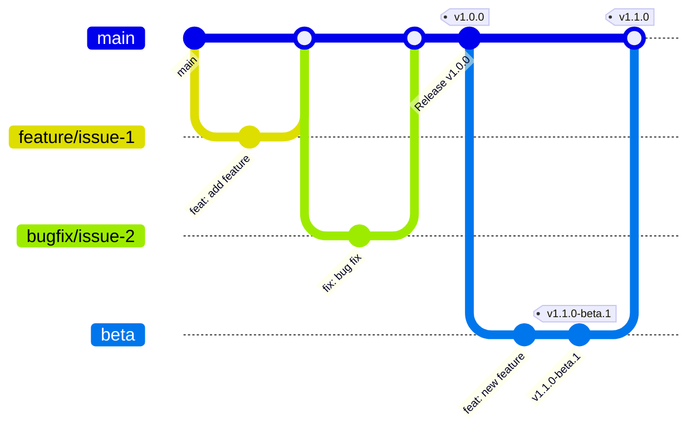

# Git Guidelines <!-- omit in toc -->

This document defines the Git workflow, branch naming conventions, commit message standards, and pull request process for the MCP Server NestJS module library. Its objective is to ensure a consistent, maintainable, and collaborative development process, while enforcing best practices and compatibility with the @modelcontextprotocol/sdk. Use this guide to understand how to contribute, manage branches, and maintain code quality in this project.

## Table of Contents <!-- omit in toc -->

- [Branch Structure](#branch-structure)
- [Workflow Diagram](#workflow-diagram)
- [Branch Naming Conventions](#branch-naming-conventions)
- [Commit Guidelines](#commit-guidelines)
  - [Format](#format)
  - [Types](#types)
  - [Version Bump by Commit Type](#version-bump-by-commit-type)
  - [Examples](#examples)
- [Pull Request Process](#pull-request-process)
- [Handling Conflicts](#handling-conflicts)
- [Branch Protection and Pull Request Rules](#branch-protection-and-pull-request-rules)
- [Revert and Rebase Policy](#revert-and-rebase-policy)
- [Automation](#automation)
- [Release Process](#release-process)
  - [Standard Release](#standard-release)
  - [Pre-releases](#pre-releases)
  - [Version Freeze](#version-freeze)
- [SemVer Versioning](#semver-versioning)

This document outlines our Git workflow, branch naming conventions, and commit message guidelines.

## Branch Structure

We follow a trunk-based development workflow with the following branches:

| Branch Type   | Created From | PR Target | Purpose                              |
| ------------- | ------------ | --------- | ------------------------------------ |
| `main`        | -            | -         | Stable production code               |
| `feature/*`   | `main`       | `main`    | New features and enhancements        |
| `bugfix/*`    | `main`       | `main`    | Bug fixes                            |
| `alpha`       | `main`       | `main`    | Early preview pre-releases (optional)|
| `beta`        | `main`       | `main`    | Feature-complete pre-releases (optional)|
| `rc`          | `main`       | `main`    | Release candidates (optional)        |

## Workflow Diagram



**Key points:**
- All development branches are created from `main`
- All branches create PRs to `main`
- Releases are triggered manually via GitHub Actions workflow dispatch
- Pre-release branches (`alpha`, `beta`, `rc`) are optional and temporary

## Branch Naming Conventions

- `feature/issue-{id}-{short-description}`: For new features
- `bugfix/issue-{id}-{short-description}`: For bug fixes
- `alpha`: For early preview pre-releases
- `beta`: For feature-complete pre-releases
- `rc`: For release candidates

Examples:

- `feature/issue-42-user-authentication`
- `bugfix/issue-75-broken-login`

## Commit Guidelines

We use conventional commits for clear and structured history. **Commit types determine version bumps automatically.**

### Format

```
<type>(<scope>): <subject>

<body>

<footer>
```

### Types

- `feat`: A new feature → **MINOR** version bump
- `feat!`: A breaking change feature → **MAJOR** version bump
- `fix`: A bug fix → **PATCH** version bump
- `docs`: Documentation changes → No release
- `style`: Formatting changes → No release
- `refactor`: Code restructuring without feature changes → No release
- `perf`: Performance improvements → **PATCH** version bump
- `test`: Test additions or corrections → No release
- `chore`: Build process or tool changes → No release

### Version Bump by Commit Type

| Commit Type | Version Bump | Example |
|-------------|--------------|---------|
| `fix:` | PATCH | 0.4.0 → 0.4.1 |
| `feat:` | MINOR | 0.4.0 → 0.5.0 |
| `feat!:` or `BREAKING CHANGE:` footer | MAJOR | 0.4.0 → 1.0.0 |
| `docs:`, `chore:`, `test:`, `style:`, `refactor:` | No release | - |

### Examples

```
feat(auth): add user login functionality

Implement JWT-based authentication with refresh tokens.

Closes #24
```

```
fix(api): correct response status codes

Change HTTP status from 200 to 201 for resource creation endpoints.

Resolves #56
```

```
feat!: change handler signature

BREAKING CHANGE: handlers now receive context as first parameter
```

## Pull Request Process

1. Create a branch from `main` using the appropriate naming convention
2. Make your changes and commit them following the commit guidelines
3. Pull the latest changes from `main`
4. Push your branch and create a PR to `main`
5. Request at least one reviewer
6. Address any feedback from code reviews
7. Once approved, the PR will be merged by a maintainer

## Handling Conflicts

If conflicts arise when merging:

1. Pull the latest changes from `main`
2. Resolve conflicts locally
3. Commit the resolved conflicts
4. Push the changes to your branch

## Branch Protection and Pull Request Rules

- Only `main` branch accepts pull requests
- The `main` branch **must be protected** against direct push and force push. Only merges via pull request are allowed.
- All other branches (e.g., `feature/*`, `bugfix/*`, `alpha`, `beta`, `rc`) can receive updates via direct push.
- The `github-actions[bot]` must be allowed to push to `main` for semantic-release to update package.json and CHANGELOG.

## Revert and Rebase Policy

<!-- TODO: Define and document the policy for revert, squash, and rebase operations on protected branches. For now, follow standard Git best practices and avoid force pushes on protected branches. -->

## Automation

All releases are automated via **semantic-release**:

- Version bumps are calculated from commit messages
- CHANGELOG.md is generated automatically
- Git tags are created automatically
- npm publishing is handled automatically
- GitHub Releases are created automatically

To trigger a release, go to **GitHub Actions → Release → Run workflow**.

## Release Process

### Standard Release

1. Develop features and fixes on `feature/*` and `bugfix/*` branches
2. Merge PRs to `main` (commits accumulate, no automatic release)
3. When ready to release, go to **GitHub Actions → Release → Run workflow**
4. semantic-release automatically:
   - Analyzes commits since last tag
   - Calculates version (patch/minor/major)
   - Updates package.json
   - Generates CHANGELOG.md
   - Creates git tag and GitHub Release
   - Publishes to npm with `@latest` tag

### Pre-releases

For early testing before a stable release:

1. Create a pre-release branch from `main`:
   ```bash
   git checkout main
   git checkout -b beta  # or alpha, or rc
   git push origin beta
   ```

2. Push commits to the pre-release branch:
   - Each push automatically publishes a pre-release
   - Example: `0.5.0-beta.1`, `0.5.0-beta.2`, etc.

3. Typical progression:
   ```
   main → alpha (0.5.0-alpha.1) → beta (0.5.0-beta.1) → rc (0.5.0-rc.1) → main (0.5.0)
   ```

4. When ready, merge the pre-release branch to `main` and trigger a release:
   ```bash
   git checkout main
   git merge beta
   git push origin main
   # Go to GitHub Actions → Release → Run workflow
   ```

5. Delete the pre-release branch after the stable release.

### Version Freeze

When you need to isolate a release while development continues:

1. Create an `rc` branch from `main`
2. Continue development on `main` for the next version
3. Only merge stabilization fixes to `rc`
4. Each push to `rc` publishes a release candidate
5. When stable, merge `rc` to `main` and trigger final release
6. Delete the `rc` branch

## SemVer Versioning

We follow Semantic Versioning (SemVer) for our releases:

- `MAJOR.MINOR.PATCH` (e.g., `1.2.3`)
- `MAJOR`: Breaking changes (triggered by `feat!:` or `BREAKING CHANGE:`)
- `MINOR`: New features, non-breaking (triggered by `feat:`)
- `PATCH`: Bug fixes (triggered by `fix:`)

Pre-release versions:

- `-alpha.N`: Early preview, unstable
- `-beta.N`: Feature-complete, may have bugs
- `-rc.N`: Release candidate, stable unless critical bugs found

Examples:

- `1.0.0`: Initial release
- `1.1.0`: New feature added
- `1.1.1`: Bug fix
- `2.0.0`: Breaking changes
- `2.0.0-beta.1`: Beta pre-release for 2.0.0
