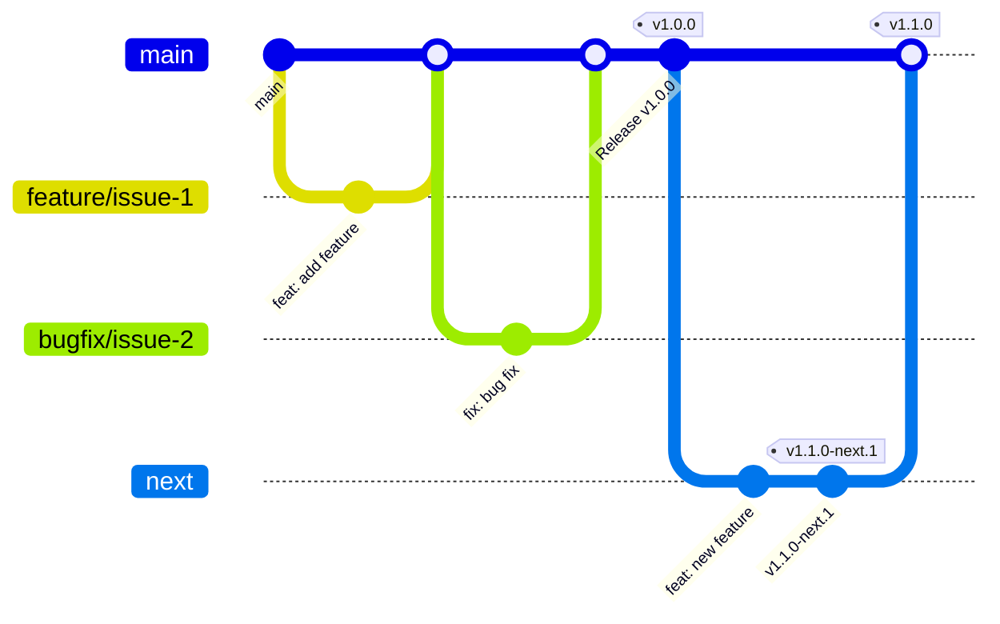

# Git Guidelines <!-- omit in toc -->

This document defines the Git workflow, branch naming conventions, commit message standards, and pull request process for the MCP Server NestJS module library. Its objective is to ensure a consistent, maintainable, and collaborative development process, while enforcing best practices and compatibility with the @modelcontextprotocol/sdk. Use this guide to understand how to contribute, manage branches, and maintain code quality in this project.

## Table of Contents <!-- omit in toc -->

- [Branch Structure](#branch-structure)
- [Workflow Diagram](#workflow-diagram)
- [Branch Naming Conventions](#branch-naming-conventions)
- [Commit Guidelines](#commit-guidelines)
  - [Format](#format)
  - [Types](#types)
  - [Version Bump by Commit Type](#version-bump-by-commit-type)
  - [Examples](#examples)
- [Pull Request Process](#pull-request-process)
- [Handling Conflicts](#handling-conflicts)
- [Branch Protection and Pull Request Rules](#branch-protection-and-pull-request-rules)
- [Revert and Rebase Policy](#revert-and-rebase-policy)
- [Automation](#automation)
- [Release Process](#release-process)
  - [Standard Release](#standard-release)
  - [Pre-releases](#pre-releases)
  - [Version Freeze](#version-freeze)
- [SemVer Versioning](#semver-versioning)

This document outlines our Git workflow, branch naming conventions, and commit message guidelines.

## Branch Structure

We follow a trunk-based development workflow with the following branches:

| Branch Type   | Created From | PR Target | Purpose                                        |
| ------------- | ------------ | --------- | ---------------------------------------------- |
| `main`        | -            | -         | Stable production code, published to `@latest` |
| `feature/*`   | `main`       | `main`    | New features and enhancements                  |
| `bugfix/*`    | `main`       | `main`    | Bug fixes                                      |
| `next`        | `main`       | `main`    | Pre-releases, published to `@next` (optional)  |

## Workflow Diagram


```mermaid
gitGraph
   commit id: "main"
   branch feature/issue-1
   commit id: "feat: add feature"
   checkout main
   merge feature/issue-1
   branch bugfix/issue-2
   commit id: "fix: bug fix"
   checkout main
   merge bugfix/issue-2
   commit id: "Release v1.0.0" tag: "v1.0.0"
   branch next
   commit id: "feat: new feature"
   commit id: "v1.1.0-next.1" tag: "v1.1.0-next.1"
   checkout main
   merge next tag: "v1.1.0"
```

**Key points:**
- All development branches are created from `main`
- All branches create PRs to `main`
- Stable releases are triggered manually via GitHub Actions workflow dispatch
- The `next` branch is optional; it exists only when a pre-release is in flight

## Branch Naming Conventions

- `feature/issue-{id}-{short-description}`: For new features
- `bugfix/issue-{id}-{short-description}`: For bug fixes
- `next`: The pre-release branch (exact name — it is declared in `.releaserc.js`)

Examples:

- `feature/issue-42-user-authentication`
- `bugfix/issue-75-broken-login`

## Commit Guidelines

We use conventional commits for clear and structured history. **Commit types determine version bumps automatically.**

### Format

```
<type>(<scope>): <subject>

<body>

<footer>
```

### Types

- `feat`: A new feature → **MINOR** version bump
- `feat!`: A breaking change feature → **MAJOR** version bump
- `fix`: A bug fix → **PATCH** version bump
- `docs`: Documentation changes → No release
- `style`: Formatting changes → No release
- `refactor`: Code restructuring without feature changes → No release
- `perf`: Performance improvements → **PATCH** version bump
- `test`: Test additions or corrections → No release
- `chore`: Build process or tool changes → No release

### Version Bump by Commit Type

| Commit Type | Version Bump | Example |
|-------------|--------------|---------|
| `fix:` | PATCH | 0.4.0 → 0.4.1 |
| `feat:` | MINOR | 0.4.0 → 0.5.0 |
| `feat!:` or `BREAKING CHANGE:` footer | MAJOR | 0.4.0 → 1.0.0 |
| `docs:`, `chore:`, `test:`, `style:`, `refactor:` | No release | - |

### Examples

```
feat(auth): add user login functionality

Implement JWT-based authentication with refresh tokens.

Closes #24
```

```
fix(api): correct response status codes

Change HTTP status from 200 to 201 for resource creation endpoints.

Resolves #56
```

```
feat!: change handler signature

BREAKING CHANGE: handlers now receive context as first parameter
```

## Pull Request Process

1. Create a branch from `main` using the appropriate naming convention
2. Make your changes and commit them following the commit guidelines
3. Pull the latest changes from `main`
4. Push your branch and create a PR to `main`
5. Request at least one reviewer
6. Address any feedback from code reviews
7. Once approved, the PR will be merged by a maintainer

## Handling Conflicts

If conflicts arise when merging:

1. Pull the latest changes from `main`
2. Resolve conflicts locally
3. Commit the resolved conflicts
4. Push the changes to your branch

## Branch Protection and Pull Request Rules

- Only `main` branch accepts pull requests
- The `main` branch **must be protected** against direct push and force push. Only merges via pull request are allowed.
- All other branches (e.g., `feature/*`, `bugfix/*`, `next`) can receive updates via direct push.
- The `github-actions[bot]` must be allowed to push to `main` for semantic-release to update package.json and CHANGELOG.

## Revert and Rebase Policy

<!-- TODO: Define and document the policy for revert, squash, and rebase operations on protected branches. For now, follow standard Git best practices and avoid force pushes on protected branches. -->

## Automation

All releases are automated via **semantic-release**:

- Version bumps are calculated from commit messages
- CHANGELOG.md is generated automatically
- Git tags are created automatically
- npm publishing is handled automatically
- GitHub Releases are created automatically

There are exactly two ways a release runs:

| Trigger | Branch | Result |
| ------- | ------ | ------ |
| **GitHub Actions → Release → Run workflow** (manual) | `main` | Stable version on `@latest` |
| Any push (automatic) | `next` | Pre-release on `@next` |

Stable releases are deliberately manual so that several merged PRs can be batched into one
version. The manual run accepts a `dry_run` input that reports the version it *would* publish
without publishing anything — use it before any major.

## Release Process

### Standard Release

1. Develop features and fixes on `feature/*` and `bugfix/*` branches
2. Merge PRs to `main` (commits accumulate, no automatic release)
3. When ready to release, go to **GitHub Actions → Release → Run workflow**
4. semantic-release automatically:
   - Analyzes commits since last tag
   - Calculates version (patch/minor/major)
   - Updates package.json
   - Generates CHANGELOG.md
   - Creates git tag and GitHub Release
   - Publishes to npm with `@latest` tag

### Pre-releases

Use a pre-release when consumers should be able to install and test a change — typically a
breaking major — before it reaches `@latest`.

> **The pre-release channel is a branch, not a tag.** `next` is a **branch name**, declared
> under `branches` in `.releaserc.js`. The git tag (`v2.0.0-next.1`) and the npm dist-tag
> (`@next`) are **outputs** semantic-release creates when it runs on that branch. You never
> create them by hand: pushing a tag yourself publishes nothing, because the Release workflow
> triggers on branches, not tags. One branch maps to exactly one dist-tag — that binding is
> why the channel is expressed as a branch in the first place.

1. Create the pre-release branch from `main`:

   ```bash
   git checkout main && git pull
   git checkout -b next
   git push origin next
   ```

   From this moment `main` is frozen — see [Version Freeze](#version-freeze). Anything merged to
   `main` before step 4 ends up in the stable release without ever having been previewed.

2. Push commits to `next`. Every push triggers the Release workflow automatically
   (`on.push.branches` in `.github/workflows/release.yml`), and semantic-release then:
   - tags the commit `v2.0.0-next.1`
   - publishes it to npm under the `@next` dist-tag, installable with
     `npm install @nestjs-mcp/server@next`
   - produces `v2.0.0-next.2` on the next push, and so on

3. Promote to stable by opening a **pull request from `next` to `main`**. `main` is protected,
   so a direct push is rejected — see
   [Branch Protection and Pull Request Rules](#branch-protection-and-pull-request-rules).
   Merge it with a **merge commit, not a squash**, so the original `feat:` / `fix:` subjects
   reach `main` intact; a squash collapses them into one subject that must then carry the
   version-bump marker itself.

4. Cut the stable version: **GitHub Actions → Release → Run workflow** on `main`.

5. Delete `next`. It is recreated from `main` the next time a pre-release is needed. Leaving it
   configured in `.releaserc.js` while the branch does not exist is harmless — semantic-release
   only requires that the branch it is *currently running on* be configured.

### Version Freeze

**While a pre-release is in flight, `main` is frozen.** The stable release is computed from
everything on `main`, so anything merged during the cycle ships in that release whether or not it
was ever previewed. Freezing is what makes the preview representative of what gets published.

1. Cut `next` from `main`. Whatever is on `main` at that moment is what the release will contain.
2. **Stop merging to `main`.** Pull requests can still be opened, reviewed and approved — they
   simply wait. This is the entire mechanism; no CI check enforces it.
3. Send stabilization fixes to `next`, never to `main`. Each push publishes a new `@next`
   pre-release, so the fixes get previewed too.
4. Promote: PR from `next` to `main`, merged with a merge commit. This is what brings the fixes
   back to `main`.
5. Cut the stable version: **GitHub Actions → Release → Run workflow** on `main`.
6. Delete `next`. The freeze is over — merge whatever was waiting.

The window runs from step 1 to step 5; keeping it short is what makes the freeze cheap.

If the freeze is broken, the release silently includes unpreviewed code. `dry_run` will not catch
it — it reports the version that would be published, not where each commit came from. Should
freezing ever become too costly, the alternative is a dedicated release branch so that `main` can
keep moving; that is a larger restructuring than this document describes.

## SemVer Versioning

We follow Semantic Versioning (SemVer) for our releases:

- `MAJOR.MINOR.PATCH` (e.g., `1.2.3`)
- `MAJOR`: Breaking changes (triggered by `feat!:` or `BREAKING CHANGE:`)
- `MINOR`: New features, non-breaking (triggered by `feat:`)
- `PATCH`: Bug fixes (triggered by `fix:`)

Pre-release versions:

- `-next.N`: Preview of the upcoming version, published from the `next` branch to the `@next`
  npm dist-tag. `N` increments on every push to that branch.

Examples:

- `1.0.0`: Initial release
- `1.1.0`: New feature added
- `1.1.1`: Bug fix
- `2.0.0`: Breaking changes
- `2.0.0-next.1`: Pre-release preview of 2.0.0
